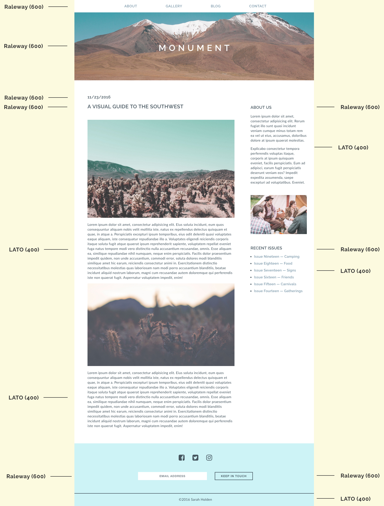
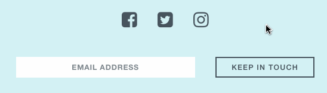

# 

| Title | Type | Duration | Author |
| -- | -- | -- | -- |
| Monument Mockup | HW  | 2:00 | Rachel Moskowitz (adapted from SF_SEI) |

 # Monument Landing Page

#### Overview

Congratulations! You have been hired as a developer for Monument Lifestyle Magazine. You work closely with a designer and have been provided with design mockups of the magazine's website. Your goal is to replicate this mockup as closely as possible.

---

#### Requirements

Your work must:

- Use a unique title and a single unique `h1` tag.
- Show images using `img` tags, including unique alt attributes.
- Use an external CSS style sheet to style your pages.
- Include a properly structured HTML file with a head and body.
- Use HTML5 structural elements (nav, header, footer).
- Follow naming conventions, maintaining consistency across your `.html` and `.css` files.
- Use IDs, classes, and nested selectors to select and style elements on the page.
- Use flexbox in your CSS to achieve a two-column layout.
- Use `inline-block` to align elements next to one another (e.g., anchors in the nav).
- Add a background image to the header.
- Use [FontAwesome](http://fontawesome.io/) icons for Facebook, Twitter, and Instagram in the footer.
- Use indentation in your HTML and CSS files to make your code readable.

**Bonus:**

- Search for and implement Google Fonts (fonts are specified in bonus mockup below).
- Make the nav "sticky" (fixed) as the user scrolls.
- Add a hover effect to the links and buttons using pseudo-classes.

#### Starter Code

The images that you'll need to recreate on the blog have been provided in the `images` folder.

#### Suggested Ways to Get Started

- First, you'll want to create an `index.html` file for the blog.
- Next, create a CSS file for the project (be sure to use the `.css` file extension).
- Add a link to the CSS file in the head of your HTML file.
- Start by writing the HTML for the assignment, focusing on the _structure_ of the page (~20 minutes).
- Look at the design and start with the most general styles. For example, what color is most of the text? Does most of the text appear to use the same `font-family` (~10 minutes)?
- Then, begin adding more specific styles for elements (~15 min).

Make sure to pay attention to detail and consider the following:

- Did you consider the relationship of your `h` tags' size to one another?
- Is the design of your `h` tags consistent?
- Did you use a similar `font-family` to the design?
- Does your nav stand out against other links but still feel consistent with the page design?
- Is anything *unstyled* or using its initial style on the page (blue, underlined links, Times New Roman font, etc.)?

## Deliverable

### Mockup

### Mockup With Bonus Tasks

### Bonus Task — Sticky Nav

### Bonus Task — Hover Effect

